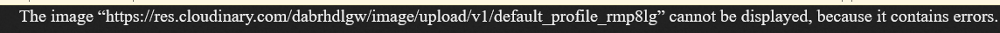
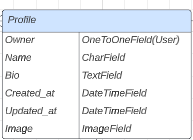

# Reader's angle - 5th portfolio project for CodeInstitute full stack course.

## Bugs and Debugging:

I've encountered an issue with cloudinary default profile image. It simply didn't load as expected and upon investigation this is what it was shown:

# Models
## Profile Model:
The Profile model represents user profiles and contains information such as the owner, creation and update timestamps, name, bio, and image.

Fields:
- owner: One-to-One relationship field linking to the User model, representing the owner of the profile.
- created_at: DateTimeField automatically set to the current date and time when the profile is created.
- updated_at: DateTimeField automatically updated to the current date and time whenever the profile is modified.
- name: CharField with a maximum length of 255 characters, allowing for an optional name for the profile.
- bio: TextField allowing for an optional bio or description for the profile.
- image: ImageField specifying the location where profile images are uploaded. It uses the 'images/' directory as the upload      destination and has a default image specified as '../default_profile_xyw4hp'.

The Meta class within the Profile model specifies the ordering of profile instances based on their creation timestamps. Profiles are ordered in descending order by created_at.

The model includes a __str__ method that returns a string representation of the profile, indicating the owner's username.

A create_profile function is defined as a signal receiver and connected to the post_save signal of the User model. This function automatically creates a profile for a newly created user.

## Post model:
The Post model represents posts related to owners/users. Each post contains information such as the owner, title, author, genre, content, creation and update timestamps, image, image filter, and genre filter.

Fields:
- owner: ForeignKey field linking to the User model, representing the owner of the post.
- title: CharField with a maximum length of 255 characters, allowing for an optional title for the post.
- author: CharField with a maximum length of 255 characters, allowing for an optional author for the post.
- genre: CharField with a maximum length of 255 characters, allowing for an optional genre for the post.
- content: TextField allowing for optional content or text associated with the post.
- created_at: DateTimeField automatically set to the current date and time when the post is created.
- updated_at: DateTimeField automatically updated to the current date and time whenever the post is modified.
- image: ImageField specifying the location where post images are uploaded. It uses the 'images/' directory as the upload destination and has a default image specified as '../default_book_w68xtp'.
- image_filter: CharField with a maximum length of 30 characters, providing choices for different image filters that can be applied to the post image. The default filter is set to 'normal'.
- genre_filter: CharField with a maximum length of 30 characters, providing choices for different genre filters that can be applied to the post. The default filter is set to 'normal'.

The Meta class within the Post model specifies the ordering of post instances based on their creation timestamps. Posts are ordered in descending order by created_at.

The model includes a __str__ method that returns a string representation of the post, displaying the post's ID and title.

## Post Follower Model:
The PostFollower model represents the followers of posts in the application. It establishes a connection between the 'owner' (user) and the 'followed_post'. The model includes a timestamp for when the follow action was created.

Fields:
- owner: This field is a foreign key referencing the User model from Django's built-in authentication system. It establishes a relationship between the PostFollower model and the user who is following the post. When a user is deleted, all associated post followers will be removed as well.
- followed_post: This field is a foreign key referencing the Post model from the 'posts' application. It represents the post being followed. When a post is deleted, all associated post followers will be removed as well.
- created_at: This field is a DateTimeField with the auto_now_add attribute set to True. It automatically records the date and time when the follow action is created.

The PostFollower model includes the following Meta options:
- unique_together: The unique_together option ensures that a user cannot follow the same post multiple times. It enforces uniqueness by specifying that the combination of 'owner' and 'followed_post' fields must be unique.

Methods:
- str(): This method returns a string representation of the PostFollower object. It displays the owner's username and the post ID being followed in the format: "[owner's username] follows post [post ID]".

## Post Status Model
The PostStatus model represents the status of a post for a specific user. It allows users to indicate whether they have read a post or intend to read it in the future.

Fields:
- owner: This field is a foreign key referencing the User model from Django's built-in authentication system. It establishes a relationship between the PostStatus model and the user who has a status for a post. When a user is deleted, all associated post statuses will be removed as well.
- post: This field is a foreign key referencing the Post model from the 'posts' application. It represents the post for which the status is being recorded. When a post is deleted, all associated post statuses will be removed as well.
- status: This field is a CharField with a maximum length of 15 characters. It allows users to choose a status for the post from predefined choices. The available choices are 'Read' and 'Will read'. Users can indicate whether they have read the book the post is about or plan to read it in the future.

Methods:
- str(): This method returns a string representation of the PostStatus object. It displays the owner and the post in the format: "[owner] [post]".

## Like Model:
The Like model represents a user's liking activity in relation to a specific post. It establishes a connection between the 'owner' (user) and the 'post' being liked. The model includes a timestamp for when the like was created.

Fields:
- owner: This field is a foreign key referencing the User model from Django's built-in authentication system. It establishes a relationship between the Like model and the user who performed the like. When a user is deleted, all associated likes will be removed as well.
- post: This field is a foreign key referencing the Post model from the 'posts' application. It represents the post that was liked. When a post is deleted, all associated likes will be removed as well.
- created_at: This field is a DateTimeField with the auto_now_add attribute set to True. It automatically records the date and time when the like is created.

The Like model includes the following Meta options:
- ordering: The ordering option specifies that the likes should be ordered in descending order based on the 'created_at' field.   This ensures that the most recent likes appear first in queries.
- unique_together: The unique_together option ensures that a user cannot like the same post twice. It enforces uniqueness by specifying that the combination of 'owner' and 'post' fields must be unique.

Methods:
- str(): This method returns a string representation of the Like object. It displays the owner and the post in the format: "[owner] [post]".

## Review Model: 
The Review model represents reviews related to users and posts. Each review contains information such as the owner, post, creation and update timestamps, and content.

Fields:
- owner: ForeignKey field linking to the User model, representing the owner of the review.
- post: ForeignKey field linking to the Post model, representing the post associated with the review.
- created_at: DateTimeField automatically set to the current date and time when the review is created.
- updated_at: DateTimeField automatically updated to the current date and time whenever the review is modified.
- content: TextField representing the content or text of the review.

The Meta class within the Review model specifies the ordering of review instances based on their creation timestamps. Reviews are ordered in descending order by created_at.

The model includes a __str__ method that returns a string representation of the review, displaying the review's content.

## ReviewLike Model:
The ReviewLike model represents the likes for reviews in the application. It establishes a connection between the 'owner' (user) and the 'review' being liked. The model includes a timestamp for when the like was created.

Fields:
- owner: This field is a foreign key referencing the User model from Django's built-in authentication system. It establishes a relationship between the ReviewLike model and the user who performed the like. When a user is deleted, all associated review likes will be removed as well.
- review: This field is a foreign key referencing the Review model from the 'reviews' application. It represents the review that was liked. When a review is deleted, all associated review likes will be removed as well.
- created_at: This field is a DateTimeField with the auto_now_add attribute set to True. It automatically records the date and time when the like is created.

The ReviewLike model includes the following Meta options:
- ordering: The ordering option specifies that the review likes should be ordered in descending order based on the 'created_at' field. This ensures that the most recent likes appear first in queries.
- unique_together: The unique_together option ensures that a user cannot like the same review twice. It enforces uniqueness by specifying that the combination of 'owner' and 'review' fields must be unique.

Methods:
- str(): This method returns a string representation of the ReviewLike object. It displays the owner who liked the review and the review itself in the format: "[owner] liked the review [review]".

# Serializers

## Profile Serializer
The ProfileSerializer is responsible for serializing and deserializing data related to the Profile model. It defines how the Profile instances are represented in JSON format.

The serializer includes the following fields:
- owner: A read-only field that represents the username of the profile owner.
- is_owner: A custom field that determines whether the authenticated user is the owner of the profile.

The serializer's Meta class defines the model and fields that should be included in the serialized representation of the Profile model. The specified fields include: id, owner, created_at, updated_at, name, bio, image, and is_owner.

## Post Serializer
The PostSerializer is responsible for serializing and deserializing data related to the Post model. It defines how the Post instances are represented in JSON format.

The serializer includes the following fields:
- owner: A read-only field that represents the username of the post owner.
- is_owner: A custom field that determines whether the authenticated user is the owner of the post.
- profile_id: A read-only field that represents the ID of the owner's profile.
- profile_image: A read-only field that represents the URL of the owner's profile image.

The serializer also includes a method called validate_image to validate the size and dimensions of the image field. It ensures that the image size is not larger than 2MB and that the height and width do not exceed 4096 pixels.

The serializer's Meta class defines the model and fields that should be included in the serialized representation of the Post model. The specified fields include: id, owner, profile_id, profile_image, created_at, updated_at, title, author, content, image, is_owner, genre_filter, and image_filter.

## PostFollower Serializer:
The PostFollowerSerializer is responsible for serializing and deserializing data related to the PostFollower model. It defines how PostFollower instances are represented in JSON format.

The serializer includes the following fields:
- owner: A read-only field that represents the username of the user who is following the post.
- followed_post: A field that allows selection of the followed post by its ID from the queryset of all posts.
- followed_post_title: A read-only field that represents the title of the followed post.

The serializer's Meta class defines the model and fields that should be included in the serialized representation of the PostFollower model. The specified fields include: id, owner, created_at, followed_post, followed_post_title

Methods:
- create(): This method overrides the default create() method of the serializer. It attempts to create a new PostFollower instance with the provided validated data. If an IntegrityError occurs, indicating a possible duplicate entry where a user is already following the post, it raises a serializers.ValidationError with the detail message "Post already followed by user. Possible duplicate."
- get_followed_post_title(obj): This method is a SerializerMethodField that retrieves and returns the title of the followed post for a given PostFollower object (obj).

## PostStatus Serializer:
The PostStatusSerializer is responsible for serializing and deserializing data related to the PostStatus model. It defines how PostStatus instances are represented in JSON format.

The serializer includes the following fields:
- owner: A read-only field that represents the username of the owner of the post status.

The serializer's Meta class defines the model and fields that should be included in the serialized representation of the PostStatus model. The specified fields include: id, post, owner, status

Methods:
- create(validated_data): This method overrides the default create() method of the serializer. It creates a new instance of the serializer's model using the provided validated data. 
If a duplicate status for the post and user is detected, the existing instance is updated with the new status instead of creating a new one. It first checks if an existing instance with the same post and owner exists. 
If found, it updates the status of the existing instance and saves it. 
If no existing instance is found, it attempts to create a new instance with the validated data. 
If an IntegrityError occurs during creation, it raises a serializers.ValidationError with the detail message "An error occurred while creating the post status."

## Like Serializer:
The LikeSerializer is responsible for serializing and deserializing data related to the Like model. It defines how Like instances are represented in JSON format.

The serializer includes the following fields:
- owner: A read-only field that represents the username of the owner of the like.

The serializer's Meta class defines the model and fields that should be included in the serialized representation of the Like model. The specified fields include: id, post, owner, created_at

Methods:
- create(validated_data): This method overrides the default create() method of the serializer. It creates a new instance of the serializer's model using the provided validated data. 
If a duplicate like for the post and user is detected, a serializers.ValidationError is raised with the detail message "Post already liked by the user. Possible duplicate." The duplication is checked by catching the IntegrityError exception.

## Review Serializer
The ReviewSerializer is responsible for serializing and deserializing data related to the Review model. It defines how the Review instances are represented in JSON format.

The serializer includes the following fields:
- owner: A read-only field that represents the username of the review owner.
- is_owner: A custom field that determines whether the authenticated user is the owner of the review.
- profile_id: A read-only field that represents the ID of the owner's profile.
- profile_image: A read-only field that represents the URL of the owner's profile image.

The serializer's Meta class defines the model and fields that should be included in the serialized representation of the Review model. The specified fields include: id, owner, post, profile_id, profile_image, created_at, updated_at, content, and is_owner.

### Review Detail Serializer
The ReviewDetailSerializer is a subclass of ReviewSerializer and is used specifically for the detail view of a review. It adds an additional field:
- post: A read-only field that represents the ID of the associated post.

## ReviewLike Serializer:
The ReviewLikeSerializer is responsible for serializing and deserializing data related to the ReviewLike model. It defines how ReviewLike instances are represented in JSON format.

The serializer includes the following fields:
-owner: A read-only field that represents the username of the owner of the review like.

The serializer's Meta class defines the model and fields that should be included in the serialized representation of the ReviewLike model. The specified fields include: id, review, owner, created_at

Methods:
- create(validated_data): This method overrides the default create() method of the serializer. It creates a new instance of the serializer's model using the provided validated data. 
If a duplicate like for the review and user is detected, a serializers.ValidationError is raised with the detail message "Review already liked by the user. Possible duplicate." The duplication is checked by catching the IntegrityError exception.

# API Views 

## PostList API View:
The PostList API view allows for listing all posts or creating a new post if the user is logged in. It is implemented as a ListCreateAPIView from the Django generics module.

A GET request to the /posts/ endpoint retrieves a list of all posts. If the user is authenticated, they can also use a POST request to create a new post. The post data is serialized using the PostSerializer class.

To ensure that only authenticated users can create posts, the IsAuthenticatedOrReadOnly permission class is used. This allows read access to anyone (even unauthenticated users) but only allows write access to authenticated users.

The perform_create method is overridden to associate the created post with the logged-in user. By saving the owner field of the post with the current user, the post is automatically linked to the user who created it.

## PostDetail API View:
The PostDetail API view is responsible for retrieving, updating, and deleting a specific post. It is implemented as a RetrieveUpdateDestroyAPIView from the Django generics module.

A GET request to the /posts/<int:pk>/ endpoint retrieves a specific post identified by its post_id. If the user is the owner of the post, they can also perform update and delete operations on the post using the appropriate request methods.

The PostSerializer class is used to serialize and deserialize the post data, ensuring consistent representation of the post in JSON format.

To restrict access and ensure that only the owner of the post can modify or delete it, the IsOwnerOrReadOnly permission class is used. This permission class allows read access to anyone but only allows write access to the owner of the post.

By utilizing the power of Django's generics module and the provided view classes, the PostList and PostDetail views offer a straightforward and efficient way to handle listing, creation, retrieval, updating, and deletion of posts.

## PostFollowerList API View:
The PostFollowerList API view is responsible for listing all post followers and creating a new post follower (i.e., following a post) if the user is logged in. It is implemented as a ListCreateAPIView from the Django generics module.

A GET request to the /post-followers/ endpoint retrieves a list of all post followers. If the user is authenticated, they can use a POST request to create a new post follower, which means they will start following a post. The post follower data is serialized using the PostFollowerSerializer class.

To ensure that only authenticated users can create post followers, the IsAuthenticatedOrReadOnly permission class is used. This permission class allows read access to anyone (even unauthenticated users) but only allows write access to authenticated users.

The perform_create method is overridden to associate the created post follower with the logged-in user. By saving the owner field of the post follower with the current user, the post follower is automatically linked to the user who created it.

## PostFollowerDetail API View:
The PostFollowerDetail API view is responsible for retrieving and deleting a specific post follower. It is implemented as a RetrieveDestroyAPIView from the Django generics module.

A GET request to the endpoint 'post_followers/<int:pk>/' retrieves a specific post follower identified by its post_follower_id. The post follower data is serialized using the PostFollowerSerializer class.

A DELETE request to the same endpoint deletes the post follower, which means the user will stop following the post. However, there is no update view for post followers, as they can only be followed or unfollowed.

To restrict access and ensure that only the owner of the post follower can delete it, the IsOwnerOrReadOnly permission class is used. This permission class allows read access to anyone but only allows write access to the owner of the post follower.

## PostStatusList API View:
The PostStatusList API view is responsible for listing all PostStatus instances and creating new PostStatus instances. It is implemented as a ListCreateAPIView from the Django generics module.

A GET request to the /post-status/ endpoint retrieves a list of all PostStatus instances. If the user is authenticated, they can use a POST request to create a new PostStatus instance. The PostStatus data is serialized using the PostStatusSerializer class.

To control access, the IsAuthenticatedOrReadOnly permission class is used. This permission class allows read access to anyone (even unauthenticated users) but only allows write access to authenticated users.

The perform_create method is overridden to associate the created PostStatus instance with the logged-in user. By saving the owner field of the PostStatus instance with the current user, the instance is automatically linked to the user who created it.

## PostStatusDetail API View:
The PostStatusDetail API view is responsible for retrieving, updating, and deleting a specific PostStatus instance. It is implemented as a RetrieveUpdateDestroyAPIView from the Django generics module.

A GET request to the /post-status/<int:pk>/ endpoint retrieves a specific PostStatus instance identified by its post_status_id. The PostStatus data is serialized using the PostStatusSerializer class.

A PUT request to the same endpoint updates the PostStatus instance with the provided data. A DELETE request deletes the PostStatus instance.

To control access and ensure that only the owner of the PostStatus instance can modify or delete it, the IsOwnerOrReadOnly permission class is used. This permission class allows read access to anyone but only allows write access to the owner of the PostStatus instance.

# Manual testing:

| Feature          | Action                                                          | Expected Result                                     | Actual Result |
| ---------------- | --------------------------------------------------------------- | --------------------------------------------------- | ------------- |
|Profile:          |
| List Profiles    | Perform GET request to /api/profiles/                           | Retrieve a list of all user profiles                | Passed!       |
| Retrieve Profile | Perform GET request to /api/profiles/:id/                       | Retrieve a specific profile by its ID               | Passed!       |
| Update Profile   | Perform PUT request to /api/profiles/:id/ with updated data     | Update a specific profile by its ID                 | Passed!       |
||
| List Posts       | Perform GET request to /api/posts/                              | Retrieve a list of all posts                        | Passed!       |
| Create Post      | Perform POST request to /api/posts/ with title and content      | Create a new post and return the created post       | Passed!       |
| Update Post      | Perform PUT request to /api/posts/:id/ with updated data        | Update a specific post by its ID                    | Passed!       |
| Delete Post      | Perform DELETE request to /api/posts/:id/                       | Delete a specific post by its ID                    | Passed!       |
||
|Poststatus :      |
| List Poststatus     | Perform GET request to /api/poststatus/                        | Retrieve a list of post status (read/will read)   | Passed!       |
| Create Poststatus   | Perform POST request to /api/postsstatus/ with post ID         | Create a new poststatus for a post and return it  | Passed!       |
| Retrieve Poststatus | Perform GET request to /api/postsstatus/:id/                   | Retrieve a specific postsstatus by its ID         | Passed!       |
| Update Poststatus   | Perform PUT request to /api/postsstatus/:id/ with updated data | Update a specific poststatus by its ID            | Passed!       |
| Delete Poststatus   | Perform DELETE request to /api/poststatus/:id/                 | Delete a specific poststatus by its ID            | Passed!       |
||
|Postfollowers :   |
| List Post_followers   | Perform GET request to /api/post_followers/                | Retrieve a list of all posts                        | Passed!       |
| Create Post_followers | Perform POST request to /api/post_followers/ with post ID  | Create a new post and return the created post       | Passed!       |
| Delete Post_followers | Perform DELETE request to /api/post_followers/:id/         | Delete a specific post by its ID                    | Passed!       |
||
|Likes :           |
| List Likes       | Perform GET request to /api/likes/                              | Retrieve a list of all user likes                   | Passed!       |
| Create Likes     | Perform POST request to /api/likes/ with post ID                | Create a new like and return the created one        | Passed!       |
| Retrieve Likes   | Perform GET request to /api/likes/:id/                          | Retrieve a specific like by its ID                  | Passed!       |
| Delete Likes     | Perform DELETE request to /api/likes/:id/                       | Delete a specific like by its ID                    | Passed!       |
||
|Reviews :         |
| List Reviews     | Perform GET request to /api/reviews/                            | List all reviews                                    | Passed!       |
| Create Reviews   | Perform POST request to /api/reviews/ with content and post ID  | Create a new review and return the created one      | Passed!       |
| Retrieve Reviews | Perform GET request to /api/reviews/:id/                        | Retrieve a specific reviews by its ID               | Passed!       |
| Update Reviews   | Perform PUT request to /api/reviews/:id/ with updated data      | Update a specific reviews by its ID                 | Passed!       |
| Delete Reviews   | Perform DELETE request to /api/reviews/:id/                     | Delete a specific reviews by its ID                 | Passed!       |
||
|Reviewlikes :         |
| List Reviewlikes     | Perform GET request to /api/reviewslikes/                   | List all reviewlikes                                | Passed!       |
| Create Reviewlikes   | Perform POST request to /api/reviewslikes/                  | Create a new reviewlike and return the created one  | Passed!       |
| Retrieve Reviewlikes | Perform GET request to /api/reviewslikes/:id/               | Retrieve a specific reviewlike by its ID            | Passed!       |
| Delete Reviewlikes   | Perform DELETE request to /api/reviewslikes/:id/            | Delete a specific reviewlike by its ID              | Passed!       |

